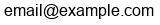
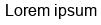

# Create image from text

Create image from text. Custom text, text angle, text padding, font size and font type.
## Getting Started

These instructions will get you a copy of the project up and running

### Installing

Install with Composer

```
composer require hracik/php-create-image-from-text
```
### Usage

```PHP
use Hracik\CreateImageFromText;

//possible return options are: RETURN_BASE64_IMG, RETURN_BASE64, RETURN_RESOURCE
$image = CreateImageFromText::createImageFromText($text, 0, 10, 12, null, CreateImageFromText::RETURN_BASE64_IMG);
```
### Examples

This is how it will look





## Running the tests

Run
```
./vendor/bin/phpunit --bootstrap vendor/autoload.php tests
```   
For Windows platforms
```
./vendor/bin/phpunit.bat --bootstrap vendor/autoload.php tests
```

## Built With

* [PHPUnit](https://phpunit.de/) - The PHP Testing Framework
* [PHP: imagettfbbox - Manual](https://www.php.net/manual/en/function.imagettfbbox.php#105593)
## Contributing

Please read [CONTRIBUTING.md](CONTRIBUTING.md) for details on our code of conduct, and the process for submitting pull requests to us.

## Versioning

We use [SemVer](http://semver.org/) for versioning. For the versions available, see the [tags on this repository](https://github.com/hracik/php-create-image-from-text/tags). 

## Authors

* **Andrej Lahucky** - *Initial work* - [Hracik](https://github.com/hracik)

See also the list of [contributors](https://github.com/hracik/php-create-image-from-text/graphs/contributors) who participated in this project.

## License

This project is licensed under the MIT License - see the [LICENSE.md](LICENSE.md) file for details.

## Acknowledgments

* PurpleBooth

